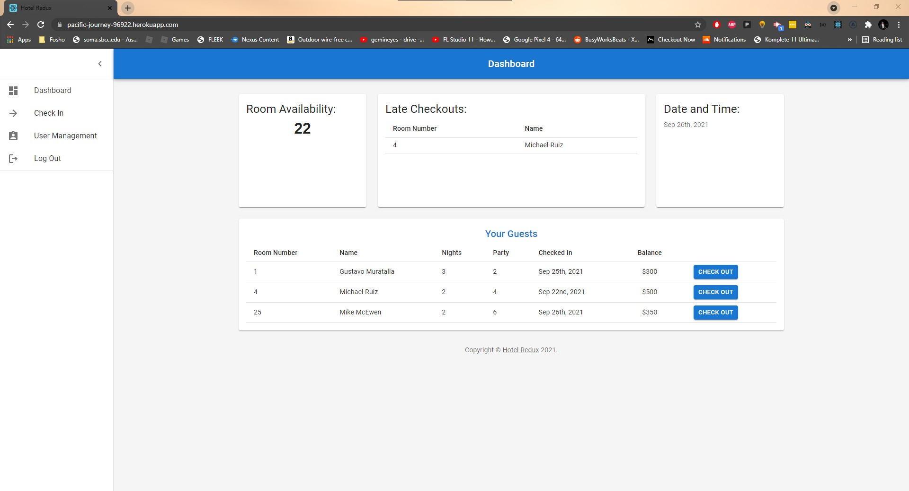

# Hotel Redux

Demo Link [here](https://pacific-journey-96922.herokuapp.com/)



## Description
This is a simple MERN stack project for the Bussiness Side of a Hotel Booking app. Employees can log in, view and check in or out guests out of their hotel.
Frontend was built with React Js and Material UI. While back was built with MongoDB and Apollo's GraphQL framework.

## Table of Contents
  - [Description](#description)
  - [Installation](#installation)
  - [License](#license)
  - [Contributing](#contributing)
  - [Technologies](#Technologies)
  - [Questions](#questions)


## Installation
1. Clone the repo and run ```npm install```
2. After installing dependencies, run ```npm run develop``` run a test server

## License


This application is covered by the MIT license. 

## Contributing
[Mike McEwen](https://github.com/mcewball13)

[Gustavo Muratalla](https://github.com/Teku-Guy)

[Michael Ruiz](https://github.com/Frostquill)


## Technologies
  - React.Js
  - MongoDB
  - Mongoose
  - Material Ui
  - Express.Js
  - Node.Js
  - JWT
  - Apollo GraphQL
  - Apollo Client
  - Apollo Server Express

## Questions?
Head over to [Github Issue](https://github.com/mcewball13/hotel-redux/issues) and open a new issue. We try our best to resolve all errors or questions


Or Message us on [:octocat:](#contributing)